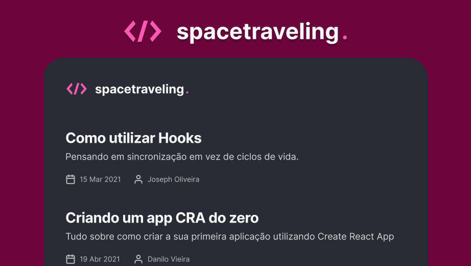

<p align="center">

<a href="https://blog-matheusm.vercel.app/">

</a>
</p>
<a href="https://blog-matheusm.vercel.app/">

<h3 align="center">
  Spacetraveling
</h3>

</a>

<p align="center">
  <a href="https://rocketseat.com.br">
    
  </a>
  
  <a href="https://www.linkedin.com/in/rafaeldcmartins/">
    
  </a>
  
  <a href="https://www.linkedin.com/in/rafaeldcmartins/">
    
  </a>
  
</p>

<br>

## :rocket: Sobre o desafio

Nesse desafio, foi criada uma aplicação para treinar o que foi aprendido durante o módulo 3, onde o seu principal objetivo é um pequeno blog com diversos conceitos interessantes como server side rendering e css modules, além de aplicar tudo que ja foi visto até agora no react.

- Listagem de posts
- Visuzalização de um post

### Lib's utilizadas
Dentro do projeto utilizamos o `Prismic` para fazer o gerenciamento dos nossos posts, o `date-fns` para lidar com as datas e o `react-icons` para disponibilizar os incones da aplicação.

<br>

## :wrench: Instalação e uso
Antes da instalação do projeto tu precisa criar uma conta no prismic e criar um documento chamado `post` com a seguinte estrutura:


  - **slug**
    - Tipo: UID
    - Descrição: Identificador único amigável de cada post. Pode receber um valor manualmente ou é gerado automaticamente a partir do primeiro campo de texto preenchido. Esse campo vai ser utilizado na navegação do Next.
- **title**
    - Tipo: Key Text
    - Descrição: Input de strings. Recebe valores manualmente. Esse campo será utilizado como título do Post.
- **subtitle**
    - Tipo: Key Text
    - Descrição: Input de strings. Recebe valores manualmente. Esse campo será utilizado como subtítulo do Post.
- **author**
    - Tipo: Key Text
    - Descrição: Input de strings. Recebe valores manualmente. Esse campo será utilizado como nome do autor do Post.
- **banner**
    - Tipo: Image
    - Descrição: Input de imagens. Recebe valores manualmente. Esse campo será utilizado como banner do Post.
- **content**
    - Tipo: Group
    - Descrição: Grupo de campos repetíveis. Esse campo será utilizado como o conteúdo do Post. O conteúdo será dividido em seções com um campo `heading` e um campo `body`.
    - Campos internos:
        - **heading**
            - Tipo: Key Text
            - Descrição: Input de strings. Recebe valores manualmente. Esse campo será utilizado como título da seção do Post.
        - **body**
            - Tipo: Rich Text                
            - Descrição: Input de *rich text* (HTML). Recebe valores manualmente. Esse campo será utilizado como conteúdo da seção do Post. Perceba que nas configurações do campo, selecionamos algumas opções para que o seu texto tenha varias formatações (negrito, hyperlinks, listas, etc.).


Após isso e gerar tuas chaves no prismic tu pode agora configurar o projeto:

```bash
# Abra um terminal e copie este repositório com o comando
git clone https://github.com/matheusm/blog

# ou use a opção de download.

# Entre na pasta com 
cd blog

#Adicione as variáveis de ambiente
#Você precisa criar uma conta no prismic
PRISMIC_API_ENDPOINT
PRISMIC_ACCESS_TOKEN

# Instale as dependências
yarn install

# Inicie a Fake API
yarn server

# Rode a aplicação
yarn start

# Acesse http://localhost:3000 no seu navagador
```

<br>

## :memo: Licença

Esse projeto está sob a licença MIT. Veja o arquivo [LICENSE](/LICENSE) para mais detalhes.

---

Feito com :purple_heart: by [Matheus Martins](https://github.com/matheusms)

Este README foi inspirado por: [@martins-rafael](https://github.com/martins-rafael)

[](https://www.linkedin.com/in/matheus-martins-sarmento/) 
